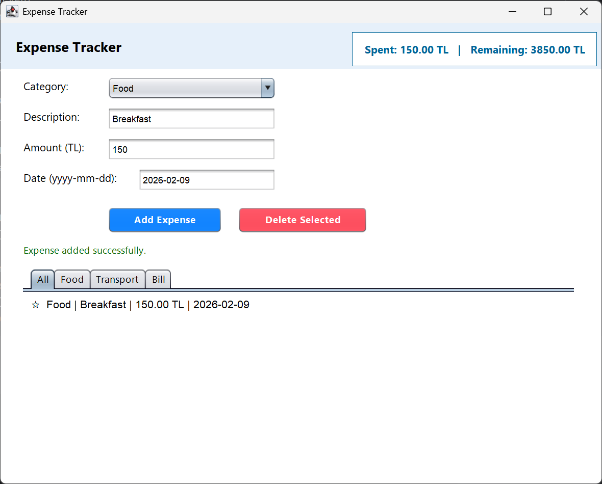

# 💰 Expense Tracker (Java GUI & Console)

An advanced **Expense Tracking Application** built with **Java**. This project demonstrates strong Object-Oriented Programming (OOP) principles. It offers both a **Graphical User Interface (Swing)** for end-users and a **Console Interface** to demonstrate the core backend logic.

## 🚀 Features

* **Dual Interface:** Run as a desktop GUI app or strictly via Terminal/Console.
* **Smart Budget Tracking:** Real-time calculation of "Total Spent" and "Remaining Budget".
* **Categorized Logging:** Add expenses under specific categories (Food, Transport, Bill).
* **OOP Design:** Utilizes Inheritance, Polymorphism, Abstraction, and Encapsulation.
* **Filtering System:** (GUI Mode) Filter the expense list by category tabs.
* **Data Validation:** Prevents negative inputs and ensures correct date formatting.

## 📸 Screenshots

### 1. User Initialization & GUI
Users start by entering their name and monthly budget goal. The dashboard provides a visual summary.


<br><br>


### 2. Adding Expenses
An intuitive form to input category, description, amount, and date.



### 3. Console / Terminal Output
The project allows testing the core logic via command line, demonstrating robust data handling without the GUI.


---

## 🛠 Tech Stack & OOP Concepts

* **Language:** Java (JDK 17+)
* **GUI:** Java Swing (JFrame, JPanel)
* **Polymorphism:** The application treats different expense types (`FoodExpense`, `TransportExpense`) uniformly.
* **Inheritance:** All specific expense classes inherit from the abstract base class `Expense`.
* **Abstraction:** The `Expense` class defines the contract (`getCategory`) that all subclasses must implement.

## 📂 Project Structure

```text
src/
├── MainFrame.java        # Entry point for the GUI version
├── ExpenseTracker.java   # Entry point for the Console version
├── ExpenseForm.java      # Form logic for adding expenses (GUI)
├── User.java             # Manages user data and budget calculations
├── Expense.java          # Abstract base class
├── FoodExpense.java      # Concrete subclass
├── TransportExpense.java # Concrete subclass
└── BillExpense.java      # Concrete subclass
