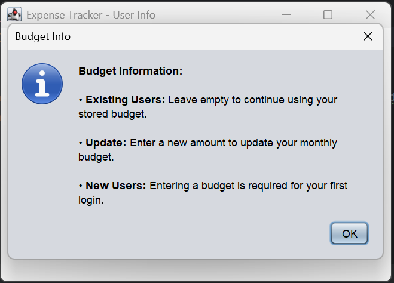
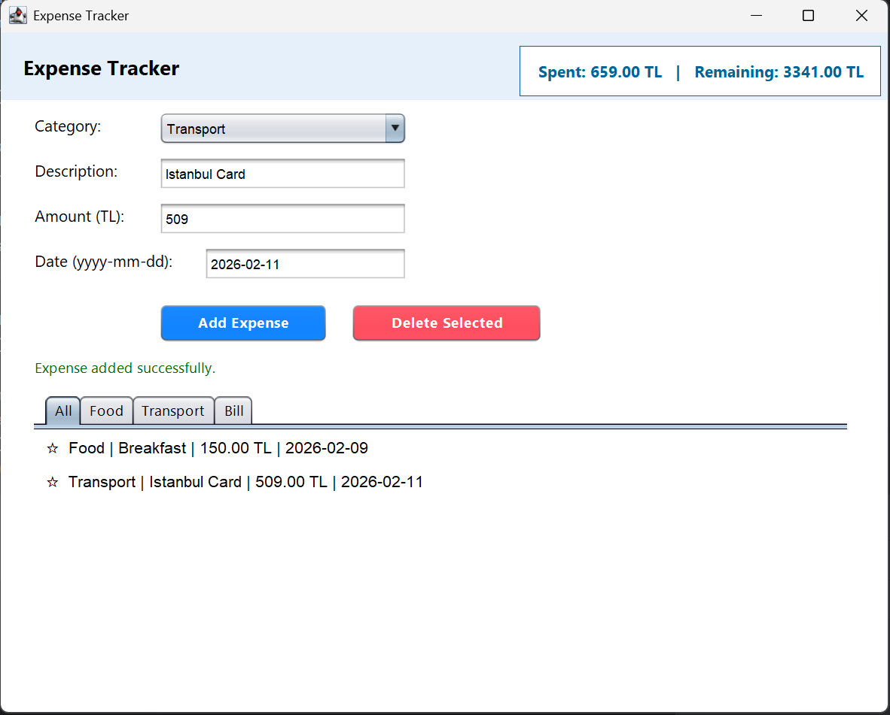
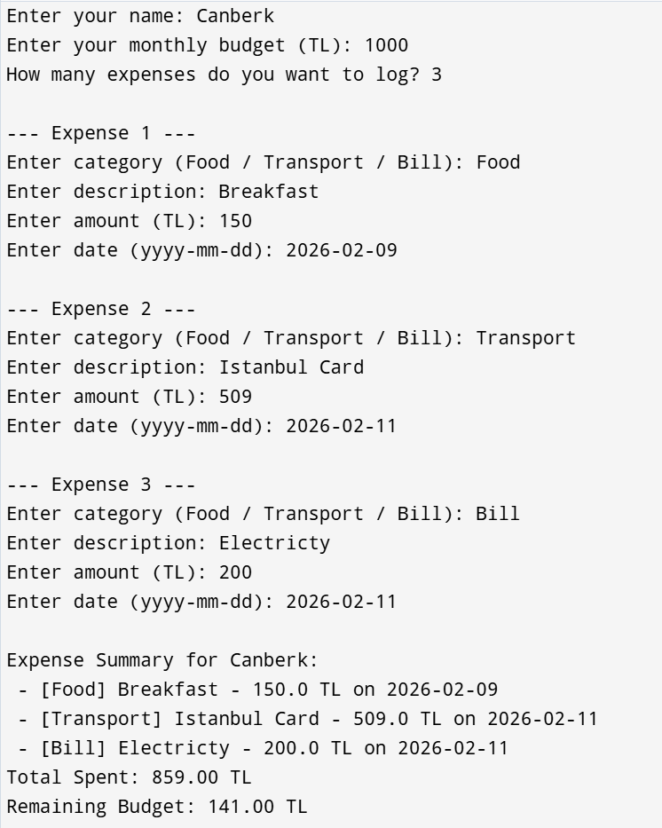

# 💰 Professional Expense Tracker System (Java & OOP)

**A high-performance financial management application featuring a dual-interface design, polymorphic data architecture, and dynamic budget security.**

This project is a complete software solution for personal finance, built with **Java SE** and **Swing**. It combines advanced Object-Oriented Programming (OOP) principles with a user-centric design to provide a robust experience for tracking expenses and managing budgets.

---

## 🚀 Key Engineering Features

* **Dynamic Budget Guard:** An event-driven security layer that prevents users from logging expenses exceeding their current available balance at the time of entry.
* **Baseline-Shift Logic:** Features a "Budget Baseline" system, allowing users to start fresh financial periods without losing their historical data.
* **Object Serialization:** Implements permanent data storage. User profiles and expense histories are saved as binary `.dat` files, ensuring no data loss between sessions.
* **Polymorphic Architecture:** Uses a single abstract contract to manage diverse expense types (`Food`, `Transport`, `Bill`) dynamically at runtime.
* **Robust Input Validation:** Every user entry is guarded by `try-catch` blocks and loop-based validation to ensure "crash-proof" operation.

---

## ⚙️ System Architecture & Engineering Decisions

### 1. Data Persistence Layer (`DataManager.java`)
The system utilizes **Java Object Serialization**. This avoids the need for a complex database while maintaining full persistence across application restarts.
* **Logic:** Converts `User` and `Expense` objects into byte streams for binary file I/O operations.

### 2. Dynamic Calculation Formula
The application calculates the remaining budget using an offset-based logic:
$$Remaining = NewBudget - (TotalSpent_{Current} - TotalSpent_{AtUpdate})$$
This ensures the system handles budget updates seamlessly while maintaining historical accuracy in the transaction list.

---

## 📸 Interface Demonstration

### 1. User Initialization & Smart Info System
The entry point allows users to authenticate and configure their financial baseline. It includes an interactive **(i)** icon that provides localized English guidance on budget management logic.

| Initial Setup | Interactive Information |
| :--- | :--- |
|  |  |

### 2. Professional Dashboard
The main control center features a live-update status header and a tabbed view to filter expenses by category instantly.



### 3. Dynamic Financial Monitoring
The dashboard's header panel dynamically repaints after every transaction, providing an immediate comparison between **Total Spent** and **Remaining Budget**.


### 4. Headless Mode (Console Application)
A robust Command Line Interface (CLI) for power users, demonstrating the core backend logic and data processing efficiency without the GUI overhead.



---

## 📊 Logic & Categorization Mapping

| Class | Category | Usage Logic | Validation |
| :--- | :--- | :--- | :--- |
| `FoodExpense` | **Food** | Daily groceries and dining | Category lock / Amount check |
| `TransportExpense`| **Transport** | Fuel, tickets, and taxi costs | Category lock / Amount check |
| `BillExpense` | **Bill** | Recurring monthly payments | Category lock / Amount check |

---

## 🔌 Project Structure
* **`MainFrame.java`**: Handles GUI initialization and theme management.
* **`ExpenseForm.java`**: The primary UI containing input security and dynamic list rendering.
* **`User.java`**: The core data model managing the budget baseline and calculations.
* **`DataManager.java`**: Utility class for binary file operations.
* **`Expense.java`**: Abstract base class enforcing the polymorphic contract.

---

## 👤 Developer
**Canberk** 

---

## 🚀 How to Run

1.  **Clone the repository.**
2.  **Ensure JDK 21+ is installed.**
3.  **Compile all files:**
    ```bash
    javac -d out src/*.java
    ```
4.  **Run Desktop Mode (GUI):**
    ```bash
    java -cp out MainFrame
    ```
5.  **Run Basic Mode (Console):**
    ```bash
    java -cp out ConsoleApp
    ```
    *(Use this for a fast, terminal-based experience without a graphical interface.)*
